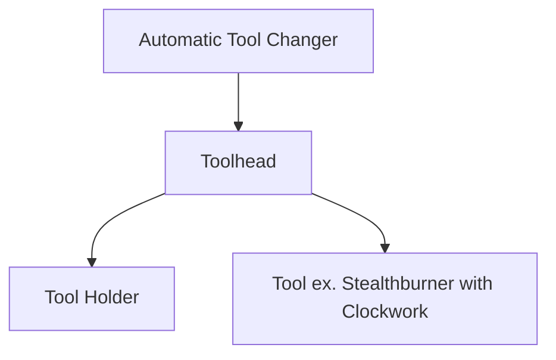

# Wireless Automatic Toolchanger

## Highlights:
#### - Wireless - No cables or wires need to be connected to the X carriage. 
#### - Intelligence built in - Lock engaged/disengaged status and tool attached/detached status reporting.
#### - Designed for a heated environment - All components are rated for continuous use at 85C or higher.
#### - Reliable - Eliminates common components that can fail (steppers, servos, torque plates, etc)
#### - Convenient - Tools are stored at the front.
#### - True kinematic coupling- Design complies with the maxwell criteria.

## Use Cases:
#### Multi-Color	
#### Multi-Material
#### Speed Optimization 
#### Hybrid Process 
###### Additive + Subtractive

## System Layout:

## Features:
- True kinematic coupling that complies with the maxwell criteria.
- Able to detect the current state of the lock mechanism. 
- Able to detect a fault in the locking mechanism (neither slider switch is triggered).
- Able to detect crashes that are not recoverable.
- Electrical connection between toolheads is rated for up to 1,000,000 cycles. 
- Compatible with two and three pin probes.

## Development Methodology:

CLICK ME

		
- Pragmatic product management  	
- Continuous improvement  
- Sound engineering theory supported by empirical testing  
 

## What it is vs What it isn't

CLICK ME

  
 

### What it isn't:
- Lighter than the stock Voron toolhead 
- Cheaper than the stock Voron toolhead	 
- Designed to mill anything that you can't extrude out of the attached hotends 
    
### What it is:  
- Compact 
- Lightweight 
- Extensible 
- Wireless 

 

	
 
## Design Requirements:
- Repeatable: <50micron Standard deviation for plastic parts
- Reliable: >100k Cycles
- Safe: Able to detect lock states and tool crashes

## Current Specifications:

CLICK ME

#### - ATC Weight: 75grams  	
#### - ATC Footprint: 68x62x35  	
#### - Operating temperature: ≤85C (all components are rated for atleast 85C)    

#### - Recomended Maximum Tool Width (without modifications): 62mm  
#### - Recomended Maximum Tool Height (without modifications): 145mm  
#### - Recomended Maximum Tool Depth (without modifications): 76mm  
 
 
#### - Number of tool changes between maintenance intervals based on component service life: >100k  
 
 
#### Weight required in the Z axis to separate the kinematic coupling:  
##### - Locked state >5000g (over the amount that I can currently measure)   
##### - Unlocked state 1750g +/-100g (connection state change occured before full decoupling)  
 
 
#### - Weight of a stealthburner with rapido, EBB36, and kinematic motor plate: 395g   

## Frequently Asked Questions:
**Q:** SmCo magnets have a TwMax of 250-350C. Why are you using NdFeB magnets?   
**A:** Our custom NdFeB magnets have an energy density 30% higher than SmCo magnets while still offering a TwMax of 150C.  

Q: How does this compare to an Idex printer? 
A: This is more complex but it is also more flexible. Additionally, a tool changer can be faster because it isn't weighed down by the second printhead on an idex printer.  

Q: Which is better, the Enraged Rabit Carrot Feededer or this? 
A: They are complementary. Any one of the tools used on the tool changer can also have virtual tools that correspond with materials in the ERCF.  

**Q:**  
**A:**  

## Support

Have questions? Building your own? **[Join the Discord!][discord]**

## Contributing

This is a community product. If you are interested in contributing, there are a number of ways to get involved:

* Review, comment, or add to the open issues on github
* Submit a user mod
* **[Join the Discord!][discord]**

[discord]: https://discord.gg/NDppsd4K
