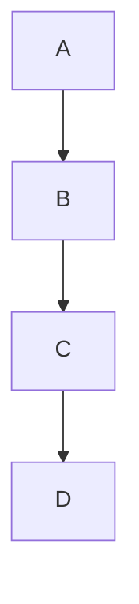

# Wireless Automatic Toolchanger

## Development Methodology:
- Pragmatic product management
- Continuous improvement
- Sound engineering theory supported by empirical testing
 
## What it is:
- Compact
- Lightweight
- Extensible
- Wireless
- 
 
## What it isn't:
- Lighter than the stock Voron toolhead
- Cheaper than the stock Voron toolhead	
- Designed to mill anything that you can't extrude out of the attached hotends
	
 
## Design Requirements:
- Repeatable: <50micron
- Reliable: >100k Cycles
- Safe: Able to detect lock states and tool crashes

 
## Current Specifications:
#### - ATC Weight: 75grams
#### - ATC Footprint: 68x62x35
#### - Operating temperature: ≤85C (all components are rated for atleast 85C)  

#### - Recomended Maximum Tool Width (without modifications): 62mm
#### - Recomended Maximum Tool Height (without modifications): 145mm
#### - Recomended Maximum Tool Depth (without modifications): 76mm
 
 
#### - Number of tool changes between maintenance intervals based on component service life: >100k
 
 
#### Weight required in the Z axis to separate the kinematic coupling:
##### - Locked state >5000g (over the amount that I can currently measure) 
##### - Unlocked state 1750g +/-100g (connection state change occured before full decoupling)
 
 
#### - Weight of a stealthburner with rapido, EBB36, and kinematic motor plate: 395g 


## Use Cases:
### Multi-Color	
### Multi-Material
### Speed Optimization 
### Hybrid Process 
##### Additive + Subtractive


## System Layout:
Here is a simple flow chart:

```mermaid 
graph TD;
    Automatic Tool Changer ATC -->; Tool Holder;
    Tool Holder -->; Tool ex. Stealthburner with Clockwork2;
```

```mermaid
graph TD;
    Automatic Tool Changer-->B;
    B-->C;
    C-->D;
```


- Automatic Tool Changer (ATC)
->
- Tool Holder 
-> 
- Tool (ex. Stealthburner with Clockwork2)

Here is a simple flow chart:




## Features:
- True kinematic coupling that complies with the maxwell criteria.
- Able to detect the current state of the lock mechanism. 
- Able to detect a fault in the locking mechanism (neither slider switch is triggered).
- Able to detect crashes that are not recoverable.
- Electrical connection between toolheads is rated for up to 1,000,000 cycles. 
- Compatible with two and three pin probes.

## Milestones:
- [X] Kinematic coupling development
- [X] Lock/unlock mechanism development
- [X] Test lock/unlock mechanism
- [ ] Tool Maintenance
- [ ] Tool Alignment 


## Frequently Asked Questions:
Q: SmCo magnets have a TwMax of 250-350C. Why are you using NdFeB magnets?
A: Our custom NdFeB magnets have an energy density 30% higher than SmCo magnets while still offering a TwMax of 150C. 


Q:

A:


Q:

A:


Q:

A:
